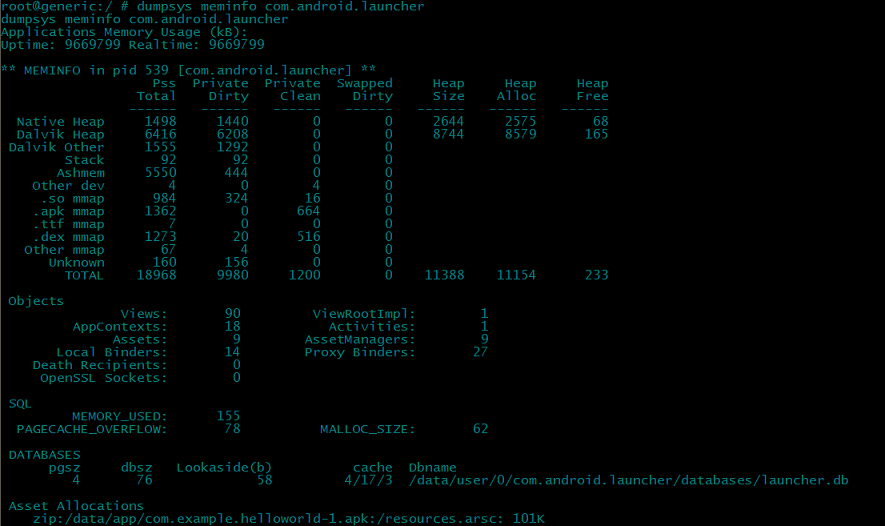
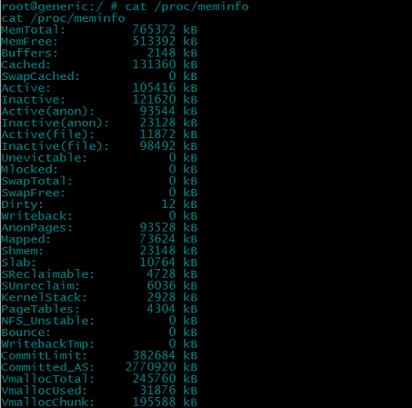
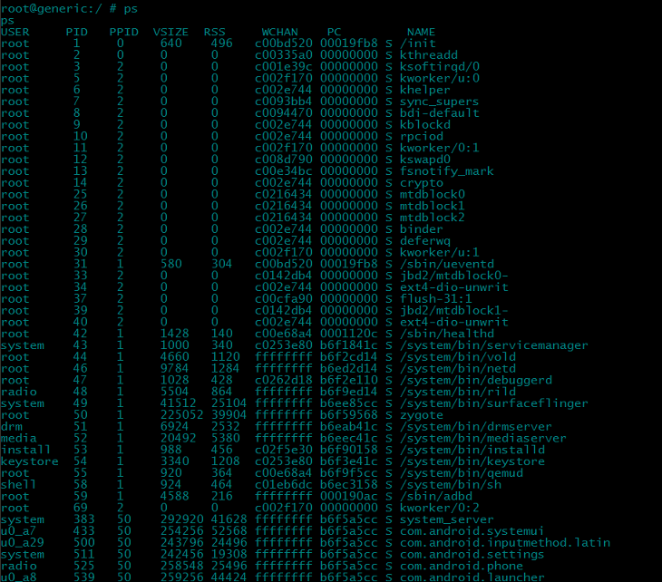
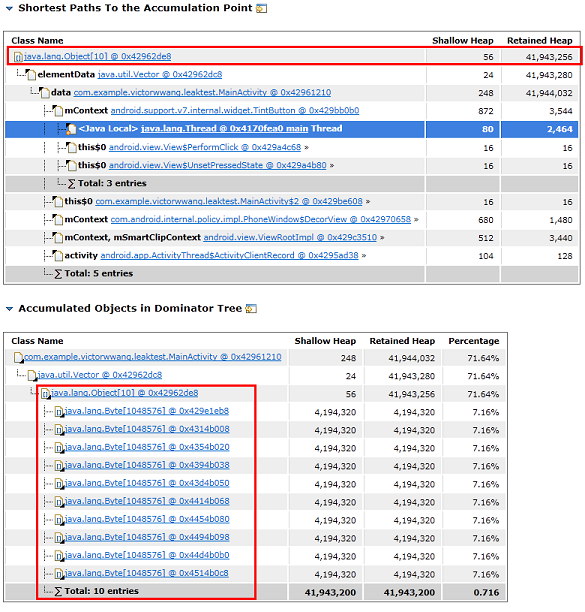
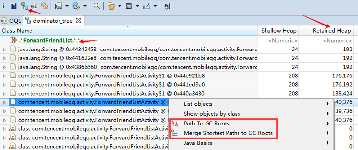

### Android内存泄漏相关汇总

---

#### 一：如何测试内存泄漏场景的存在
下面描述几种Android应用内存泄漏定位方法。  
  
##### 1. `procrank`命令
  
`procrank`命令可以获取当前系统各进程内存占用快照，从`/proc/pid/maps`读取相关信息而来。  
  
进入adb shell，执行`procrank`，输出如下：  
  

  
极有可能您的手机`procrank`已被阉割，那就启动Android虚拟机，从`/system/xbin`目录pull一个吧，记得也要pull`/system/lib`目录的`libpagemap.so`~  
  
几个名词介绍：  
* VSS – Virtual Set Size 虚拟耗用内存（包含共享库占用的内存）  
* RSS – Resident Set Size 实际使用物理内存（包含共享库占用的内存）  
* PSS – Proportional Set Size 实际使用的物理内存（比例分配共享库占用的内存，共享库由很多进程共享，按每一个进程占有比例乘以共享库占用内存，加上USS，就是PSS）  
* USS – Unique Set Size 进程独自占用的物理内存（不包含共享库占用的内存）  

对于`VSS`、`RSS`、`PSS`均包含共享库内存占用部分，实际工作中以`USS`为参照。  
  
最底下的一行简单解释：`total`（全部）、`free`（空闲）、`buffers`、`cached`、`shmem`（共享内存）、`slab`。  
  
那么如何测试应用在使用过程中存在内存泄漏问题呢？  
  
    写个脚本，每隔固定采样时间（比如5s），执行一次procrank，把结果输出到指定文件，  
	持续多长时间你自己控制，这个过程中疯狂的使用待测app。  
  
> 注意：procrank命令不支持输出单个进程的内存信息，结果输出到指定文件前，需要用grep做过滤。（grep被阉割，请安装busybox）。  

  
脚本名称：procleak.sh，当然你也可以把脚本功能完善的更丰富一点。  
```bash
#!/system/bin/sh

# Uage:
#       procleak.sh procname

if [ $# != 1 ]; then
  echo "Uage: $0 procname"
  exit 1
fi

OUTPUT='/sdcard/procleak.log'

echo 'timestamp\tPID\tVss\tRss\tPss\tUss\tcmdline' >> $OUTPUT

while true; do
  timestamp=`date '+%Y-%m-%d %H:%M:%S'`
  key=$1'$'
  meminfo=`procrank | busybox grep ${key}`

  echo $timestamp'\t'$meminfo >> $OUTPUT

  sleep 5
done

```
以手Q运行为例：  
1. `push`到手机sd卡；  
2. 执行`sh procleak.sh com.tencent.mobileqq &`,记下pid；  
> 注意：这里有坑，Windows和Linux的换行符不一样，`push`前先转一转。  
> 我习惯用Sublime Text，有一个插件不错`LineEndings`，专门用来转行尾换行符。  
3. 放肆的操作手Q，一段时候后，`kill pid`，在sd卡拿出log文件进行分析；  
  
拿到`procleak.log`，重点关注`USS`一列数据，可以借助Excel做出内存消耗曲线图。  
  

  
如果内存消耗在一段时间内保持稳定，那么可以认为没有发生leak；反之，内存消耗稳定上升，那就是有leak点了！  
  
> 补充：`showmap`命令查看Android进程内存占用情况。  
  
##### 2. `dumpsys`命令
`dumpsys`命令用处很多，基本可以用来dump系统的各种信息，比如内存信息、CPU信息、activities信息、windows信息、wifi信息等。  
  

  
这里`PrivateDirty`是我们关心的数据，等同于上文`USS`。我们一样可以编写脚本，定时做dumpsys，提取`TOTAL`-`PrivateDirty`对应位置数据，汇总输出，最后借助Excel做出内存消耗曲线图。  
  
```bash
# TODO：脚本开发
```
  
  
##### 3. `cat /proc/meminfo`获取系统内存信息
  

  
读取`meminfo`文件，可以获取Android系统内存分配、内存使用情况，可以了解当前系统是否处于内存紧张状态，系统层面的宏观认识，对具体到某一应用的内存情况，此方法无能为力。  
  
##### 4. `ps`获取进程信息
`ps`加`grep`，展示某一进程信息，其中进程信息包括`RSS`占用情况。可是上文我们说过，`RSS`包括共享库部分，可以参考，但是一般不用。  
  

  
##### 5. Debug.getMemoryInfo()或者ActivityManager.getProcessMemoryInfo()
调用上述两个函数，都会返回`MemoryInfo`对象，`MemoryInfo`详细描述了应用内存情况，字段如下：  
  

  
各字段的含义：  
`dalvik`，是指dalvik所使用的内存；  
`native`，是指native使用的内存，比如C\C\++在堆上分配的内存；  
`other`，是指除dalvik和native使用的内存，比如共享内存。  
`Private`，私有，不包含共享库；  
`Share`，包含共享库；  
`PSS`，参考上文，比例分配共享库占用的内存。  
  
其实你应该会发现，上述两个函数的返回结果，和`dumpsys meminfo`命令返回结果一致，很明显他们内部应该都是走的一套系统调用。  
  
我们关心的是Private，调用MemoryInfo`getTotalPrivateDirty()`，可以返回进程私有内存占用，等同于上文`USS`。  
可以在App中起一个线程，每隔5s，读取MemoryInfo，输出`TotalPrivateDirty`到日志文件，测试结束后，借助Excel做出内存消耗曲线图。代码如下：  
  
```java
private Thread thread = new Thread() {

	@Override
	public void run() {
		super.run();

		String state = Environment.getExternalStorageState();
		// SDCard是否可用
		if (Environment.MEDIA_MOUNTED.equals(state)) {
			File path = new File(Environment.getExternalStorageDirectory().getPath() + "/dump/");
			if (!path.exists()) {
				path.mkdirs();
			}
			String logPath = path.getAbsolutePath();
			if (!logPath.endsWith("/")) {
				logPath += "/";
			}
			logPath = logPath + "procleak.log";
			File file = new File(logPath);

			try {
				FileWriter writer = new FileWriter(file);
				writer.write("timestamp" + "\t" + "VSS" + "\t" + "PSS" + "\t" + "USS" + "\n");
				writer.flush();
				Debug.MemoryInfo memInfo = new Debug.MemoryInfo();

				while (!finish) {
					Debug.getMemoryInfo(memInfo);
					SimpleDateFormat sdf = new SimpleDateFormat("yyyy-MM-dd-HH-mm-ss");
					String timestamp = sdf.format(new Date(System.currentTimeMillis()));

					writer.write(timestamp + "\t" + memInfo.getTotalSharedDirty() + "\t" + memInfo.getTotalPss() + "\t" + memInfo.getTotalPrivateDirty() + "\n");
					writer.flush();

					// 延时5s
					try {
						Thread.sleep(5 * 1000);
					} catch (InterruptedException e) {
						e.printStackTrace();
					}
				}

				writer.close();

			} catch (IOException e) {
				e.printStackTrace();
			}
		}
	}

};
```
  
同时，借助ActivityManager.getRunningAppProcesses()与ActivityManager.getProcessMemoryInfo()，可以写一个`工具App`，专门用来获取待测试应用的内存使用，输出统计日志(完全可以借助图标库，在工具App中可视化展示)，这样在不修改待测试应用源码的（增加循环读内存信息的线程代码）基础上做到检测内存的目的。  
  
> 拓展阅读：  
> * ActivityManager.getMemoryInfo() 返回系统当前内存情况  
  
##### 6. DDMS
借助DDMS中的Heap页，可以直观的看到应用内存占用情况。  
  
具体操作：  
* 打开DDMS的Devices视图/Heap视图；  
* 选择要监控的进程；  
* 选中Devices视图上的`update heap`图标;  
* 点击Heap视图中的`Cause GC`按钮，留意`Allocated`值变动；  
* 疯狂使用待测应用，期间定时点击`Cause GC`按钮，留意`Allocated`值变动，如果数值持续上涨，那就是内存泄漏了。  
  

  
当然该方法比较粗糙，较小的内存泄漏可能不容易用这种方法发现。  
  
如果你习惯用Android Studio，`Memory Monitor`可以完成同样的功能，数据可视化形式也更直观、更友好。  
  

  
#### 二：如何获取hprof文件
通过上文介绍的各种方法，我们可以明确待测应用是否发生了内存泄漏，如果发生了内存泄漏，下一步就是dump出泄漏前后heap快照文件，通过分析heap快照文件，明确知道泄漏的对象是哪些，已经如何fix内存泄漏问题。  
  
##### 1. Debug.dumpHprofData()
Android API提供了Debug.dumpHprofData()获取hprof文件，通过该方法，需要修改待测试应用的源码，参考代码如下：
  
```java
public static boolean dumpHeapFile() {
	boolean ret = false;

	SimpleDateFormat sdf = new SimpleDateFormat("yyyy-MM-dd-HH-mm-ss");
	String createTime = sdf.format(new Date(System.currentTimeMillis()));

	String state = Environment.getExternalStorageState();
	// SDCard是否可用
	if (Environment.MEDIA_MOUNTED.equals(state)) {
		File file = new File(Environment.getExternalStorageDirectory().getPath() + "/dump/");
		if (!file.exists()) {
			file.mkdirs();
		}

		String hprofPath = file.getAbsolutePath();
		if (!hprofPath.endsWith("/")) {
			hprofPath += "/";
		}
		hprofPath += createTime + ".hprof";

		try {
			Debug.dumpHprofData(hprofPath);
			ret = true;
		} catch (IOException e) {
			e.printStackTrace();
		}
	} else {
		ret = false;
	}

	return ret;
}
```
  
在测试应用前，先dump出`heap快照1`，然后疯狂使用应用，让应用尽情去泄漏，一段时间后再次dump出`heap快照2`。  
  
##### 2. DDMS
直接点击Devices视图上的`Dump HPROF file`图标，导出heap快照文件。这种方法的好处是，完全不用修改待测应用的源码。  
  
#### 三：再转hprof文件
获取的hprof文件是Dalvik格式，直接用MAT打开，会报错，需要转成Java虚拟机规范格式。  
  
	hprof-conf old.hprof new.hprof
  
#### 四：MAT打开hprof文件
说了这么多，这才是正题！  
  
启动MAT（推荐下载独立的MAT程序，Eclipse中插件装多了，会很卡的，当然Eclipse JVM参数调优可以缓解下，但只是缓解下~），Open Heap Dump，MAT分析结束会有两个TAB页：`Overview`、`Leak Suspects`。  
  
先解释三个名词：  
1. `Shallow Heap`：指对象自身所占用的内存大小，不包含其引用的对象所占的内存大小。
  * 数组类型：数组元素对象所占内存的大小总和;
  * 非数组类型：对象与它所有的成员变量大小的总和，当然这里面还会包括一些java语言特性的数据存储单元；
2. `Retained Heap`：当前对象大小 + 当前对象可直接或间接引用到的对象的大小总和。
3. `GC Root`：Java中GC策略是基于对象`引用是否可达`来判断是否需要GC，引用可达判断起点就是GC Roots。JVM规范定义如下GC Roots：
  * Class：class loaded by system class loader；
  * Thread：live thread；
  * Stack Local：local variable or parameter of Java method；
  * JNI Local：local variable or parameter of JNI method；
  * JNI Global：global JNI reference；
  * Monitor Used：objects used as a monitor for synchronization；
  * Held by JVM：objects held from garbage collection by JVM for its purposes；
  
MAT在展示对象列表时，会对`GC Root`特别标注，如图：  
  

  
一则分析示例：  
1. 先从`Leak Suspects`入手，从怀疑点一开始；  


  
2. 可以发现是10个`Byte[1048576]`对象泄漏，泄漏总量41943256Byte，泄漏最短路径是：elementData-data-mContent-main Thread(GC Root)；  
3. 剩下的工作就是看代码了。  
  
上面的示例显然是最简单的，稍微复杂一点的场景，需要打开`dominator_tree`TAB页，按照`正则`搜索，或者`Retained Heap`排序，找出可能的泄漏点。然后展开泄漏对象，就可以大致知道泄漏的问题所在了。  
  


  
当然MAT有一个辅助窗口很有用，`Inspector`，对于那些匿名类对象，可以根据`Inspector`窗口展示的信息，推测出对应源码的哪一个匿名类。  
  
比如`MainActivity`中的匿名类`FragmentActivity$1`，分析`Inspector`展示的信息，可以得出匿名类`FragmentActivity$1`对应源码。  
  


  
更复杂一点的场景，...  
  
#### 五：Android常见内存泄漏场景汇总

  
<br />
#### 六：参考链接
1. [How do I discover memory usage of my application in Android?](http://stackoverflow.com/questions/2298208/how-do-i-discover-memory-usage-of-my-application-in-android)
2. [Android内存之VSS/RSS/PSS/USS  ](http://hubingforever.blog.163.com/blog/static/17104057920114411313717/)
3. [也谈Android内存那点事——深入内存数据和MAT应用](http://km.oa.com/group/2714/articles/show/109931?kmref=search)
4. [Android平台应用程序内存泄漏确认与定位](http://www.oschina.net/question/54100_38558)
5. [Android内存泄露工具MAT使用介绍](http://km.oa.com/group/23213/articles/show/197041?kmref=search)
6. [Android内存](http://hubingforever.blog.163.com/blog/#m=0&t=1&c=fks_084065082084086064081084083095085081080067080086083068093)
7. [Android 内存监测工具 DDMS --> Heap](http://blog.csdn.net/feng88724/article/details/6460918)
8. [Memory Analyzer tool(MAT)分析内存泄漏---理解Retained Heap、Shallow Heap、GC Root](http://blog.csdn.net/hhww0101/article/details/8133219)

