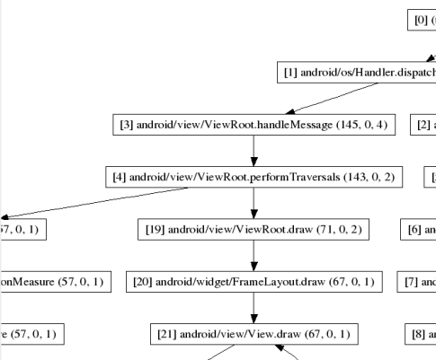
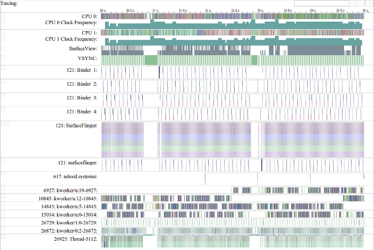

## Android开发-开发工具

#### Android开发的那些工具  
本文将分三块描述，其一是Android `SDK`中提供的一些小工具；其二是用于开发Android应用的`Android Studio`+`Gradle`集成开发工具与构建工具；其三是一些很棒的`第三方`工具。  
 
  
#### 1. Android SDK中的那些[小工具][1]
伴随Android SDK提供的工具分为两大块，一是`SDK Tools`，与平台无关的工具；二是`Platform Tools`，平台相关的工具。  
  
这些工具在SDK中具体的存放路径很`飘逸`，一方面不同版本的SDK同一个工具存放的位置可能不一致(现在新版本比老版本好一点了)；另一方面`SDK Tools`与`Platform Tools`工具分散在多个文件夹下，文件名命名也容易让人误解，比如明明是`SDK Tools`工具却放置在`Platform Tools`文件夹下。  
  
具体`飘逸`的路径如下表：  

| 路径 | 描述 |
| :----: | :---- |
| /SDK/tools/ | 一些平台无关的工具，如`ddms`、`emulator`等 |
| /SDK/platform-tools/ | 一些平台无关与一些平台相关的工具，如`adb`、`sqlite3`等 |
| /SDK/build-tools/19.0.3/ | 平台相关(API 19)的工具，如`aapt`、`aidl`等 |

下面分别介绍下。  

##### Platform Tools
平台相关工具，顾名思义这些工具是为了支持平台新特性，同时向下兼容。  
  
* 最常用的平台相关工具：`ADB`，[Android Dedug Bridge][2]
  
常见用法如下：

| 命令 | 描述 |
| :----: | :---- |
| adb shell | 启动当前设备/模拟器`shell`环境 |
| adb install apk文件全路径名 | 向当前设备/模拟器`安装`应用 |
| adb uninstall 应用包名 | 从当前设备/模拟器`卸载`应用 |
| adb pull 源文件 目标文件 | 从当前设备/模拟器拷贝文件到本地 |
| adb push 源文件 目标文件 | 从本地向当前设备/模拟器拷贝文件 |

注意：使用`adb shell`进入设备`shell`环境，但是该shell环境很多工具都没有，比如`grep`，因为Android删除了部分Linux标准工具。如果想使用这些工具，可以在越狱的手机上安装[`Busybox`][3]。  
  
* `dx`
  
我们知道Android系统的java虚拟机是`Dalvik`(Android L引入的ART以后再说)，该虚拟机字节码为`DEX`格式。我们在PC上编译java源码产生的class文件，最后就要经过`dx`工具转换为`Dalvik`字节码，这一步还有一些优化，比如合并常量池、消除冗余信息等。  
  
* `dexdump`
  
和`dx`相对，反编译用。  
  
* `aapt`
  
Android工程中有相当多的资源文件，包括`AndroidMaifest.xml`、`/res/`目录、`/asserts/`目录，全是由`aapt`工具进行验证、编译、压缩，并生成`R.java`文件。
  
* `aidl`
  
编译`*.aidl`文件为`*.java`文件。
  
* `llvm-rs-cc`
  
编译`*.rs`文件为`*.java`文件与`*.bc`文件。[参考4][4]
  
##### SDK Tools
非平台相关工具，主要包括一些sdk管理、虚拟机管理、调试、性能优化等工具，下面主要介绍会用到的一些。  
  
* [`zipalign`][5]
  
对签名后的apk文件做对齐处理，将apk包中的资源文件距离文件起始偏移为4字节的整数倍。和C语言结构体对其一个意思，加快访问速度。  
  
* `android`
  
管理SDK。  
  
* `ddms`(Dalvik Debug Monitor Server)
  
用于应用的Debug，包括日志输出，整合全部的分析工具等。  
  
* `draw9patch`
  
用于`.9图片`编辑。**重点**，可以看看[这里][6]。  
  
* `emulator`
  
管理虚拟机。  
  
* `hierarchyviewer`
  
用于布局分析与优化。**重点**，网上一大堆文章，这里是[官方文档][7]。  
  
* `hprof-conv`
  
在分析应用内存使用情况，比如内存泄露，OOM等，可以获取`heap dump`内存文件用`MAT(Memory Analyzer Tool)`进行离线分析。由于Android虚拟机`dalvik`的特殊性，产生的内存文件hprof与标准的java hprof文件格式不一致，那么就需要`hprof-conv`工具转换，才可以用`MAT`工具进行分析。**重点**，可以看看[这里][8]，这篇文章直接在`DDMS`中进行操作，相关转换工作已经被隐藏了。  
  
* `traceview`
  
Android应用运行数据分析工具，用于定位程序执行的热点，指导后续程序优化用。**重点**，可以看看[这里][9]。  
  
* `dmtracedump`
  
用于生成Android应用函数调用关系图。我在项目中未使用过，感觉`traceview`足够了。  
  

  
* `systrace`
  
Android 4.1加入的新的性能分析工具，存放位置`/sdk/platform-tools/systrace`。我在项目中还没有具体使用过，这里是[官方文档][10]。  
  

  
**注：上文几个标记为`重点`的优化工具需要重点留意。**  
 
  
#### 2. 简单说说`Gradle`构建工具
 
  
#### 3. 三方工具
 
  

---
#### 参考文献
1. [Tools Help][1]
2. [Android Debug Bridge][2]
3. [为Android安装BusyBox][3]
4. [Android RenderScript on LLVM][4]
5. [zipalign][5]
6. [App自适应draw9patch不失真背景][6]
7. [Using Hierarchy Viewer][7]
8. [Android应用程序的内存分析][8]
9. [Android系统性能调优工具介绍][9]
10. [Analyzing Display and Performance][10]

[1]: http://developer.android.com/intl/zh-cn/tools/help/index.html#tools-sdk
[2]: http://developer.android.com/intl/zh-cn/tools/help/adb.html
[3]: http://www.cnblogs.com/xiaowenji/archive/2011/03/12/1982309.html
[4]: https://events.linuxfoundation.org/slides/2011/lfcs/lfcs2011_llvm_liao.pdf
[5]: http://developer.android.com/intl/zh-cn/tools/help/zipalign.html
[6]: http://www.cnblogs.com/qianxudetianxia/archive/2011/04/17/2017591.html
[7]: http://developer.android.com/intl/zh-cn/tools/debugging/debugging-ui.html#HierarchyViewer
[8]: http://www.cnblogs.com/wisekingokok/archive/2011/11/30/2245790.html
[9]: http://my.oschina.net/innost/blog/135174#OSC_h3_11
[10]: https://developer.android.com/intl/zh-cn/tools/debugging/systrace.html

