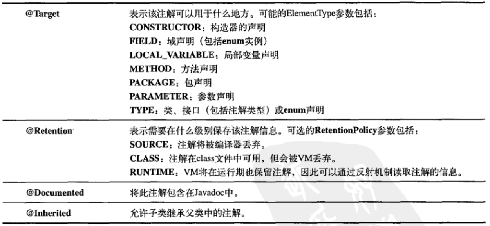

## Annotation学习笔记

#### 默认的三种注解(`Java SE5`加入)
* `@Override`
* `@Deprecated`
* `@SuppressWarnings`

#### 定义注解(不支持继承)
* 元注解`meta-annotation`，负责注解其他的注解

> `@Target`  
> `@Retention`  
> `@Documented`  
> `@Inherited`  

>   

* 注解元素

> 注解元素类型限制  
> * 所有基本类型（int，float，boolean等）  
> * String  
> * Class  
> * enum  
> * Annotation，嵌套注解  
> * 以上类型的数组  

> 默认值限制  
> * 元素要么有默认值，要么在使用时提供初始值，不允许空值

* 定义注解示例

> 示例选取：定义基本的对象/关系映射功能，能够自动生成数据库表  

```java
	// 用于表名称注解
	@Target(ElementType.TYPE)
	@Retention(RetentionPolicy.RUNTIME)
	public @interface DBTable {
    	public String name() default "";
	}
    
    // 用于表列约束注解
    @Target(ElementType.FIELD)
    @Retention(RetentionPolicy.RUNTIME)
    public @interface Constraints {
        public boolean primaryKey() default false;
    
        public boolean allowNull() default true;
    
        public boolean unique() default false;
    }
    
    // 用于表列类型注解
    @Target(ElementType.FIELD)
    @Retention(RetentionPolicy.RUNTIME)
    public @interface SQLString {
        public int value() default 0;
    
        public String name() default "";
    
        public Constraints constraints() default @Constraints;
    }
    
    // 用于表列类型注解
    @Target(ElementType.FIELD)
    @Retention(RetentionPolicy.RUNTIME)
    public @interface SQLInteger {
        public String name() default "";
    
        public Constraints constraints() default @Constraints;
    }
```

* 使用注解

> 基于上述示例
> 元素赋值快捷方式，如果元素名为`value`，在应用该注解时，该元素为唯一需要赋值的元素

```java
    @DBTable(name = "MEMBER")
    public class Member {
    
        @SQLString(30)
        public String firstName;
        @SQLString(30)
        public String lastName;
        @SQLInteger
        public Integer age;
        @SQLString(value = 30, constraints = @Constraints(primaryKey = true))
        public String handle;
    
        public static int memberCount;
    
        public String getFirstName() {
            return firstName;
        }
    
        public String getLastName() {
            return lastName;
        }
    
        public Integer getAge() {
            return age;
        }
    
        public String getHandle() {
            return handle;
        }
    
        @Override
        public String toString() {
            return handle;
        }
    
    }
```

* 实现注解处理器

> 基于上述示例，实现的注解处理器示例

```java
    public class TableCreator {
    
        /**
         * @param args
         * @throws ClassNotFoundException
         */
        public static void main(String[] args) throws ClassNotFoundException {
            // TODO Auto-generated method stub
    
            if (args.length < 1) {
                System.out.println("arguments:annotated classes");
                System.exit(0);
            }
    
            for (String className : args) {
                Class<?> cl = Class.forName(className);
    
                DBTable dbTable = cl.getAnnotation(DBTable.class);
                if (dbTable == null) {
                    System.out.println("No DBTable annotation in class "
                            + className);
                    continue;
                }
                String tableName = dbTable.name();
                if (tableName.length() < 1) {
                    tableName = cl.getName().toUpperCase();
                }
    
                List<String> columnDefs = new ArrayList<String>();
    
                for (Field field : cl.getDeclaredFields()) {
                    String columnName = null;
                    Annotation[] anns = field.getAnnotations();
                    if (anns.length < 1) {
                        continue;
                    }
                    if (anns[0] instanceof SQLInteger) {
                        SQLInteger sInt = (SQLInteger) anns[0];
                        if (sInt.name().length() < 1) {
                            columnName = field.getName().toUpperCase();
                        } else {
                            columnName = sInt.name();
                        }
    
                        columnDefs.add(columnName + " INT"
                                + getConstraints(sInt.constraints()));
                    }
    
                    if (anns[0] instanceof SQLString) {
                        SQLString sString = (SQLString) anns[0];
                        if (sString.name().length() < 1) {
                            columnName = field.getName().toUpperCase();
                        } else {
                            columnName = sString.name();
                        }
    
                        columnDefs.add(columnName + " VARCHAR(" + sString.value()
                                + ")" + getConstraints(sString.constraints()));
                    }
                }
    
                StringBuilder createCommand = new StringBuilder("CREATE TABLE "
                        + tableName + "(");
                for (String columnsDef : columnDefs) {
                    createCommand.append("\n\t" + columnsDef + ",");
                }
                String tableCreate = createCommand.substring(0,
                        createCommand.length() - 1)
                        + ");";
                System.out.println("Table Creation SQL for " + className + " is:\n"
                        + tableCreate);
    
            }
        }
    
        private static String getConstraints(Constraints con) {
            String constraints = "";
            
            if (!con.allowNull()) {
                constraints += " NOT NULL";
            }
            if (con.primaryKey()) {
                constraints += " PRIMARY KEY";
            }
            if (con.unique()) {
                constraints += " UNIQUE";
            }
    
            return constraints;
        }
    
    }
```

* `JUnit4`与`注解`

> 之前版本`JUnit`，需要创建测试类，并且测试方法采用`test函数名`形式，这里`函数名`指待测试的函数，使用`assert`特殊族函数  
> `JUnit4`增加`@Test`注解，不用新建测试类(`嵌入式`与`非嵌入式`)，并且测试方法命名随意，可以使用java assert语句与java异常机制  
> `JUnit4`的非嵌入式测试可以基于`继承`与`组合`方式  
> 简单示例如下：  

```java
	public class HashSetTest {
    	
        HashSet<String> testObject = new HashSet<String>();
        
        @Test
        void initialization() {
        	assert testObject.isEmpty();
        }
        
        @Test
        void _contains() {
        	testObject.add("one");
            
            assert testObject.contains("one");
        }
        
        @Test
        void _remove() {
        	testObject.add("one");
            testObject.remove("one");
            
            assert testObject.isEmpty();
        }
        
        public static void main(String[] args) {
        	OSExecuteCommand("java net.mindview.atunit.AtUnit HashSetTest");
        }
        
    }
```

> 具体java单元测试后续学习，留待日后


#### TIDOLIST
1. 使用`apt`处理注解

#### 参考文献
1. 《Java编程思想》
