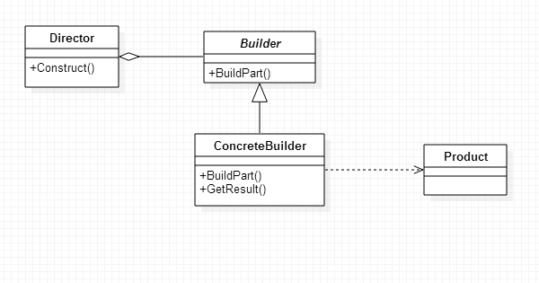

#### BUILDER模式
  
将一个复杂对象的构建与它的表示分离，使得同样的构建过程可以创建不同的表示。  
  
###### 1. 结构


###### 2. 适用性
* 当创建复杂对象的算法应该独立于该对象的组成部分以及它们的装配方式时；
* 当构造过程必须允许被构造的对象有不同的表示时；

###### 3. 实现
* Builder.java
  
```java
public interface Builder {

    public void buildPart();

}
```
  
* ConcreteBuilder.java
  
```java
public class ConcreteBuilder implements Builder {

    private Product mProduct;

    @Override
    public void buildPart() {

    }

    public Product getResult() {
        return mProduct;
    }

}
```
  
* Product.java
  
```java
public interface Product {
}

```
  
* Director.java
  
```java
public class Director {

    private Builder mBuilder;

    public Director(Builder mBuilder) {
        this.mBuilder = mBuilder;
    }

    public void construct() {
        mBuilder.buildPart();
    }

}
```
  
* 测试用例
  
```java
public class Main {

    public static void main(String[] args) {
        ConcreteBuilder builder = new ConcreteBuilder();
        Director director = new Director(builder);
        director.construct();
        // 获取产品
        Product product = builder.getResult();
    }

}
```
  
