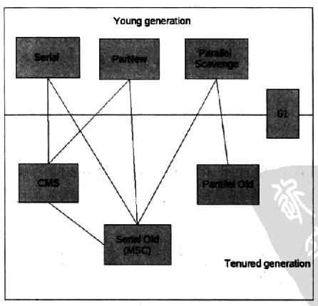

## Java一二

#### Java内存泄露
对于Java这一类`内存托管`语言，内存泄露的主要原因：保留下来却永远不再使用的对象引用。  
> 内存泄露事例  

```java
Vector v = new Vector(10);
for (int i = 0; i < 10; ++i) {
	Object o = new Object();
	v.add(o);
	o = null;
}
```

对于C/C++来说，内存泄露的范围更大一些，有些对象被分配了内存空间，然后却不可达，这些内存将永远收不回来；而在Java中，这些对象可由GC回收。  

#### Java垃圾收集
###### 1.运行时数据区域划分  
JVM执行Java程序会把它所管理的内存划分为若干个不同的数据区域。  
> JVM运行时数据区
  
<center></center>  
  
垃圾收集`堆`、`方法区`，其他区域不管。  
  
###### 2.垃圾收集理论部分
垃圾收集需要完成的三件事情：那些内存需要回收？什么时候回收？如何回收？  
  
定位待回收对象，采用`根搜索算法（GC Roots Tracing）`，而不是单纯的`引用计数算法`。  
  
如何回收对象，可采用算法有：`标记清除（Mark-Sweep）`、`复制（Copying）`、`标记整理（Mark-Compact）`、`分代收集（Generational Collection）`。  
> Sun HotSpot，分代策略：方法区->`永久代`、堆一部分->`老年代`、堆一部分->`新生代`（具体细分为`Eden`、`Survivor 1`、`Survivor 2`）  
  
什么时候回收对象，一方面是说内存分配满足特定的垃圾收集器设定的阈值，触发收集；另一方面是程序线程执行到相关`安全点`/`安全区域`，垃圾收集器执行相关收集工作。  

###### 3.典型垃圾收集器  
> HotSpot JVM垃圾收集器
  
<center></center>  
  
重点关注的几个：`Parallel Scavenge`、`CMS`、`G1`。其中`G1`没有分代的概念，有一个分区`region`的概念。  
  
JVM调优会涉及到垃圾收集器选择与设置。  
  
#### Java Object
###### 1.toString()
###### 2.hashCode()
###### 3.equals()
###### 4.clone()
###### 5.多个wait()
###### 6.notify()
###### 7.notifyAll()
###### 8.getClass()
###### 9.fianlize()


#### Java Container